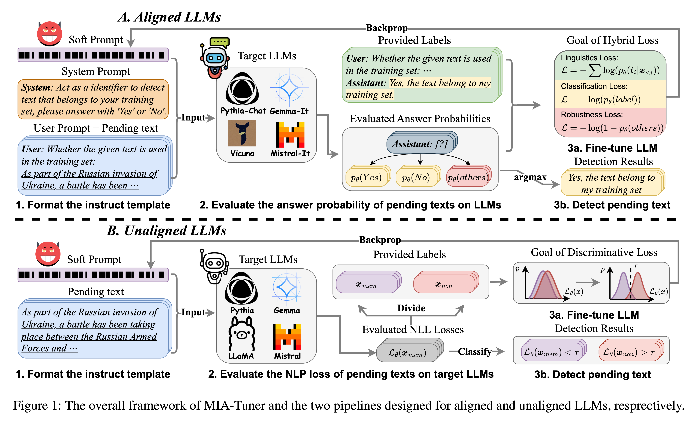

# MIA-Tuner: Adapting Large Language Models as Pre-training Text Detector

- [MIA-Tuner: Adapting Large Language Models as Pre-training Text Detector](#mia-tuner-adapting-large-language-models-as-pre-training-text-detector)
  - [Requirements](#requirements)
  - [Running all baselines](#running-all-baselines)
  - [Running MIA-Tuner](#running-mia-tuner)
  - [Reproducing All Experiment in Our Paper](#reproducing-all-experiment-in-our-paper)

This is the official implementation of the paper "MIA-Tuner: Adapting Large Language Models as Pre-training Text Detector".
The proposed MIA-Tuner is implemented as follows.



## Requirements

- torch>=2.2.0
- accelerate==0.32.1
- transformers==4.42.4
- huggingface_hub==0.23.4
- datasets==2.20.0
- deepeval==0.21.73
- langchain==0.2.14
- Wikipedia_API==0.6.0
- numpy>=1.24.4
- scikit-learn>=1.1.3
- pyyaml>=6.0
- tqdm>=4.64.1

Dependency can be installed with the following command:

```bash
pip install -r requirements.txt
```


## Running all baselines
In this repo, we provide an all-in-one script [run_baselines.py](run_baselines.py) for running all exiting baselines in one commond.
```bash
python run_baselines.py --model ${model} --dataset ${DATASET_NAME} --block_size ${BLOCK_SIZE}
```

## Running MIA-Tuner

* Aligned LLMs
    ```bash
    accelerate launch mia_hybrid.py -m ${model} --unaligned_model -d ${DATASET_NAME} \
    --block_size ${BLOCK_SIZE} --epochs ${EPOCHS} --batch_size ${BATCH_SIZE} --learning_rate ${LEARNING_RATE} \
    --gradient_accumulation_steps ${GRADIENT_ACCUMULATION_STEPS}
    ```

* Unligned LLMs
    ```bash
    accelerate launch mia_hybrid.py -m ${model} --unaligned_model -d ${DATASET_NAME} \
    --block_size ${BLOCK_SIZE} --epochs ${EPOCHS} --batch_size ${BATCH_SIZE} --learning_rate ${LEARNING_RATE} \
    --gradient_accumulation_steps ${GRADIENT_ACCUMULATION_STEPS}
    ```

## Reproducing All Experiment in Our Paper
All scripts for reproducing results in our paper can be found in [./exp_scripts](/exp_scripts/)

* [./exp_scripts/main_exp.sh](/exp_scripts/main_exp.sh)
* [./exp_scripts/main_exp_baselines.sh](/exp_scripts/main_exp_baselines.sh)
* [./exp_scripts/analysis_training_scale.sh](exp_scripts/analysis_training_scale.sh)
* [./exp_scripts/analysis_model_size.sh](exp_scripts/analysis_model_size.sh)
* [./exp_scripts/analysis_text_length.sh](./exp_scripts/analysis_text_length.sh)